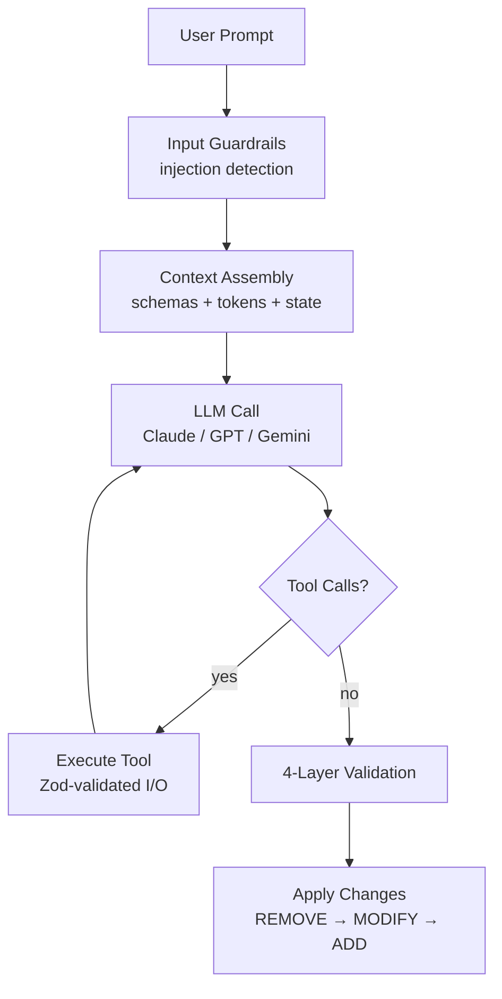

# AI Orchestration Playbook

> What if you could tell an AI "build me a pricing page with 3 cards" and get back a validated, schema-safe component tree — not a blob of HTML, not a hallucinated mess, but a structured JSON tree that your app can actually render?

This project is a working implementation of the patterns required to do that. I built it from first-hand experience designing the AI orchestration backend for a composable CMS platform — where AI generates structured UI within strict schema rules, across multiple LLM providers, with real safety guarantees.

## What This Actually Does

Imagine you're building a page builder (like Webflow, Framer, or a CMS visual editor). You want users to say "add a hero section with a heading and two buttons" and have the AI produce valid changes to a component tree.

The hard parts:

1. **The AI will hallucinate components.** It'll invent `<MagicButton>` when your system only has `Button`. The schema registry solves this — the AI only sees components you've registered.

2. **You can't trust the output.** The AI might inject `<script>` tags or reference components that don't exist. Four validation layers catch this before anything touches your tree.

3. **You're locked to one LLM vendor.** OpenAI goes down, your product goes down. The provider abstraction lets you switch between Claude, GPT-4, or Gemini with zero code changes.

4. **Complex tasks need multiple steps.** "Build a pricing page" isn't one LLM call — the AI needs to inspect the current tree, look up schemas, validate intermediate work. The agent loop handles this with tool calling.

**Run the demo to see it in action (no API keys needed — everything runs locally):**

```bash
npm install
npm run demo
```

The demo exercises every pattern end-to-end: registers components, builds and transforms a component tree, blocks script injection attacks, verifies checksums, executes tools with Zod validation, and streams typed events. It uses simulated generation (not live LLM calls) so you can run it instantly without any `.env` or API keys.

**Or view the [visual architecture showcase](docs/index.html)** — a deployable single-page site explaining every pattern with interactive diagrams.

## Architecture



Full diagrams (Mermaid format, renderable on GitHub):

- [System Architecture](docs/diagrams/system-architecture.mermaid) — end-to-end data flow
- [Agent Loop](docs/diagrams/agent-loop.mermaid) — sequence diagram of multi-turn generation
- [Provider Fallback](docs/diagrams/provider-fallback.mermaid) — how model switching works
- [Validation Layers](docs/diagrams/validation-layers.mermaid) — the 4 safety layers

## Project Structure

```
src/
├── types/              # Type contracts between all subsystems
├── orchestrator/       # LLM provider abstraction + agent loop
│   ├── provider.ts     # OpenAI, Anthropic providers + fallback chain
│   ├── orchestrator.ts # Multi-turn agent loop with tool calling
│   └── prompt-builder.ts
├── schema/             # Component schema registry
│   └── registry.ts     # Register, validate, produce AI context
├── tools/              # Tool-calling system
│   └── registry.ts     # Zod-validated I/O, timeout, retry, abort
├── validation/         # Output safety
│   └── guardrails.ts   # 4 layers: schema, structural, safety, checksum
├── streaming/          # Real-time inference processing
│   └── stream-processor.ts
├── pipeline/           # Ties everything together
│   └── generation-pipeline.ts
├── examples/
│   └── demo.ts         # Runnable demo of all patterns
└── __tests__/          # 33 tests across 3 suites
```

## The 6 Patterns

### 1. Schema-Guided Generation

You register your component schemas. The registry validates them upfront, then produces a compact, token-efficient representation that gets injected into the AI's system prompt. The AI can only use what you've defined.

```typescript
registry.register({
  type: 'Card',
  displayName: 'Card',
  props: {
    title: { type: 'string', required: true },
    variant: { type: 'enum', enum: ['default', 'elevated', 'outlined'] },
  },
  slots: {
    footer: { displayName: 'Footer', allowedTypes: ['Button'], maxChildren: 3 },
  },
});

// Tree validation catches problems before they reach the user
const result = registry.validateTree(tree);
// → errors: ["Unknown component type "FakeWidget" at root → children → FakeWidget"]
```

### 2. Model-Agnostic Provider Abstraction

Messages are normalized internally. Each provider (OpenAI, Anthropic) transforms at the boundary. The factory returns the first available provider from a priority list. This is the pattern implementation — **your app supplies its own credentials when wiring up providers; this repo has no `.env` or API keys.**

```typescript
// In your app, you'd wire this up with your own API keys:
const factory = new ProviderFactory();
factory.register(new AnthropicProvider(creds, logger));
factory.register(new OpenAIProvider(creds, logger));

// If Anthropic is down, OpenAI takes over automatically
const provider = factory.getAvailable(['anthropic', 'openai']);
```

### 3. Zod-Validated Tool Calling

Every tool defines input and output schemas with Zod. The registry validates both sides at runtime — the AI can't send bad data, and the tool can't return garbage. Built-in timeout, retry with exponential backoff, and abort support.

```typescript
const tool = defineTool({
  name: 'fetch_cms_data',
  description: 'Fetch entries from the CMS',
  inputSchema: z.object({ contentType: z.string(), limit: z.number().default(10) }),
  outputSchema: z.object({ entries: z.array(z.record(z.unknown())), total: z.number() }),
  execute: async (input, ctx) => { /* your logic */ },
  timeout: 10_000,
  retryPolicy: { maxRetries: 2, backoffMs: 1000, backoffMultiplier: 2 },
});
```

### 4. Multi-Layer Output Validation

AI output passes through four layers before it touches your application:

| Layer | What it catches | Example |
|-------|----------------|---------|
| Schema Conformance | Hallucinated types, unknown props | Rejects `<MagicWidget>` |
| Structural Integrity | Duplicate UIDs, missing parents | Catches orphaned nodes |
| Safety Guardrails | Script injection, event handlers | Blocks `<script>`, `onclick=` |
| Checksum Verification | Stale changes from slow generation | Warns if tree changed mid-generation |

### 5. Streaming with Backpressure

Typed event system (text, thinking, tool_start, tool_result, change, done, error) with NDJSON/SSE parsing, configurable buffer limits, and AbortController support.

### 6. Checksum-Based State Verification

Before applying changes, SHA-256 checksums verify the target node hasn't changed since generation started. Prevents overwriting concurrent edits in collaborative environments.

## Tests

```
33 tests passing across 3 suites:

schema-registry  — 11 tests (registration, validation, filtering, tree validation)
tool-registry    — 9 tests  (execution, input validation, retry, timeout, abort)
validation       — 13 tests (guardrails, injection detection, checksums, ordering)
```

```bash
npm test              # run all tests
npm run test:watch    # watch mode
npm run typecheck     # strict TypeScript validation
```

## Architecture Decision Records

Each major design choice is documented with context, decision, and tradeoffs:

- [001 — Model-Agnostic Provider Design](docs/adr/001-model-agnostic-design.md)
- [002 — Agentic Loop with Tool Calling](docs/adr/002-agentic-loop-design.md)
- [003 — Schema-Guided Generation](docs/adr/003-schema-guided-generation.md)
- [004 — Tool-Calling Architecture](docs/adr/004-tool-calling-architecture.md)
- [005 — Multi-Layer Validation Strategy](docs/adr/005-validation-strategy.md)
- [006 — Streaming Architecture](docs/adr/006-streaming-architecture.md)
- [007 — Pipeline Composition](docs/adr/007-pipeline-design.md)

## Tech Stack

TypeScript (strict mode), Zod (runtime validation), EventEmitter3 (typed events), Vitest (tests), Node.js 20+.

Zero heavy dependencies. The entire project is ~5,000 lines of TypeScript with 2 runtime dependencies.

## Background

I designed these patterns while building the AI orchestration backend for a composable CMS platform — an LLM-driven application builder where AI generates structured UI compositions within enterprise schema constraints. That codebase is proprietary, but the architectural patterns are universal. This project reimplements them from scratch as a reference for anyone building production AI systems that need to generate structured, validated output.

## License

MIT — Ankita Dodamani
